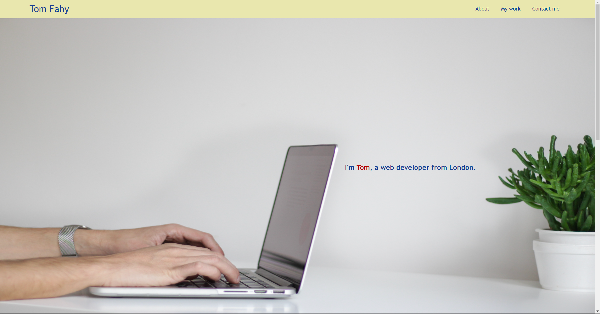

# Portfolio

## Description 

This website is to display other work I have done throughout my time as a web developer.

A link to the website can be found here: https://fahyt.github.io/portfolio/

## Installation

The project is a static webpage hosted on Github Pages so no installation is required apart from a web browser of your choice.

## Usage 

The website is a static page and is easy to use. Simply click the navigation links at the top-right of the page to be taken to an article explaining more on that topic.

## Credits

https://developer.mozilla.org/en-US/docs/Web/CSS/position was extremely helpful for understanding attribution in CSS more clearly.

## License

MIT License

Copyright (c) 2023 Thomas Fahy

Permission is hereby granted, free of charge, to any person obtaining a copy
of this software and associated documentation files (the "Software"), to deal
in the Software without restriction, including without limitation the rights
to use, copy, modify, merge, publish, distribute, sublicense, and/or sell
copies of the Software, and to permit persons to whom the Software is
furnished to do so, subject to the following conditions:

The above copyright notice and this permission notice shall be included in all
copies or substantial portions of the Software.

THE SOFTWARE IS PROVIDED "AS IS", WITHOUT WARRANTY OF ANY KIND, EXPRESS OR
IMPLIED, INCLUDING BUT NOT LIMITED TO THE WARRANTIES OF MERCHANTABILITY,
FITNESS FOR A PARTICULAR PURPOSE AND NONINFRINGEMENT. IN NO EVENT SHALL THE
AUTHORS OR COPYRIGHT HOLDERS BE LIABLE FOR ANY CLAIM, DAMAGES OR OTHER
LIABILITY, WHETHER IN AN ACTION OF CONTRACT, TORT OR OTHERWISE, ARISING FROM,
OUT OF OR IN CONNECTION WITH THE SOFTWARE OR THE USE OR OTHER DEALINGS IN THE
SOFTWARE.

